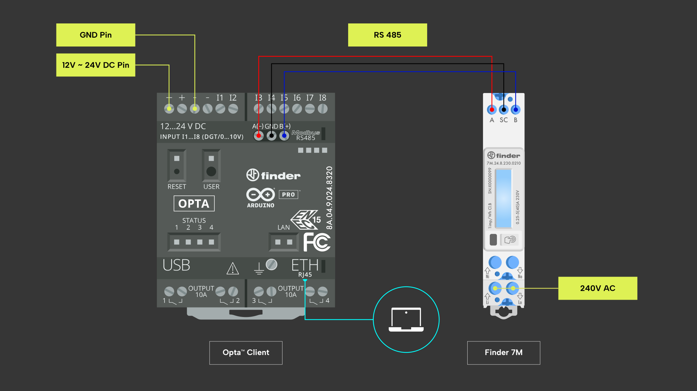

## Panoramica

Nei precedenti esempi abbiamo discusso [come utilizzare il Finder Opta per
leggere da un contatore di energia Finder serie
7M](https://github.com/dndg/FinderOpta7MTutorial/blob/main/content-it.md)
tramite il protocollo Modbus. In questo tutorial, impareremo a implementare il
multithreading su Finder Opta per leggere contemporaneamente il Finder serie 7M
e inviare i valori ottenuti a un server HTTP remoto tramite Ethernet. In
particolare, un thread continuerà a leggere un contatore certificato MID dal
Finder serie 7M, mentre il `loop()` trasmetterà il valore letto ogni cinque
secondi.

## Obiettivi

* Imparare a implementare il multithreading su Finder Opta.
* Imparare a leggere contemporaneamente da un contatore di energia Finder serie
  7M e inviare periodicamente la misura a un server HTTP remoto all'interno
  dello stesso sketch.

## Requisiti hardware e software

### Requisiti hardware

* PLC Finder Opta con supporto RS-485 (x1).
* Contatore di energia Finder serie 7M (x1).
* Alimentatore DIN rail 12VDC/1A (x1).
* Cavo USB-C® (x1).
* Cavo ETH RJ45 (x1).
* Cavo per la connettività RS-485 con una delle seguenti specifiche (x2):
  * STP/UTP 24-18AWG (non terminato) con impedenza di 100-130Ω.
  * STP/UTP 22-16AWG (terminato) con impedenza di 100-130Ω.

### Requisiti Software

* [Arduino IDE 1.8.10+](https://www.arduino.cc/en/software), [Arduino IDE
2.0+](https://www.arduino.cc/en/software) o [Arduino Web
Editor](https://create.arduino.cc/editor).
* Se si utilizza Arduino IDE offline, è necessario installare le librerie
  `ArduinoHttpClient`, `ArduinoRS485` e `ArduinoModbus` utilizzando il Library
  Manager dell'Arduino IDE. Inoltre, bisognerà installare la libreria `Finder
  7M per Finder Opta`: è possibile clonarla [da
  GitHub](https://github.com/dndg/Finder7M) direttamente nella directory
  contenente tutte le altre librerie.
* [Codice di esempio](assets/OptaMultithreadingExample.zip).
* Un server HTTP per stampare i dati ricevuti dal Finder Opta: per semplicità è
  consigliato [http-echo-server](https://github.com/watson/http-echo-server),
  che può essere facilmente configurato su un computer con pochi comandi.

## Finder Opta e Multithreading

Essendo una board basata su Mbed OS, Finder Opta può sfruttare la classe
[`Thread`](https://os.mbed.com/docs/mbed-os/v6.16/apis/thread.html) per creare
e controllare task paralleli. Ciò ci consente di scrivere loop aggiuntivi che
possono essere eseguiti in parallelo alla funzione `loop()`, che è invece il
thread principale.

Inoltre, Finder Opta può sfruttare la funzione `millis()` per accedere al suo
stopwatch, ovvero il numero di millisecondi trascorsi da quando la board
Arduino ha iniziato l'esecuzione dello sketch: utilizzando questo cronometro
possiamo orchestrare l'esecuzione dei diversi thread nel nostro programma.

## Istruzioni

### Configurazione dell'Arduino IDE

Per seguire questo tutorial, sarà necessaria [l'ultima versione dell'Arduino
IDE](https://www.arduino.cc/en/software). Se è la prima volta che configuri il
Finder Opta, dai un'occhiata al tutorial [Getting Started with
Opta](/tutorials/opta/getting-started).

Assicurati di installare l'ultima versione delle librerie
[ArduinoHttpClient](https://www.arduino.cc/reference/en/libraries/arduinohttpclient/),
[ArduinoModbus](https://www.arduino.cc/reference/en/libraries/arduinomodbus/) e
[ArduinoRS485](https://www.arduino.cc/reference/en/libraries/arduinors485/),
poiché verranno utilizzate per implementare rispettivamente la comunicazione
con il server e il protocollo di comunicazione Modbus RTU.

Infine, per installare la libreria `Finder 7M for Finder Opta`, puoi clonarla
[da GitHub](https://github.com/dndg/Finder7M) e quindi spostarla nella cartella
_libraries_ all'interno del tuo sketchbook. Per ulteriori dettagli su come
installare manualmente le librerie, consulta [questo
articolo](https://support.arduino.cc/hc/en-us/articles/5145457742236-Add-libraries-to-Arduino-IDE).

### Connessione tra Finder Opta e Finder serie 7M

Come [nel tutorial
precedente](https://github.com/dndg/FinderOpta7MTutorial/blob/main/content-it.md#connessione-tra-finder-opta-e-finder-serie-7m),
dovremo alimentare il Finder Opta con l'alimentatore da 12VDC/1A e collegarlo
al 7M tramite una connessione seriale RS-485. Inoltre, per questo tutorial
connetteremo il Finder Opta al computer che ospita il server HTTP utilizzando
un cavo Ethernet RJ45. Per completare questi passaggi, consulta il diagramma in
figura:



Per far funzionare il codice di esempio, è necessario configurare i seguenti
parametri di comunicazione del 7M:

* Indirizzo Modbus `2`.
* Baudrate `38400`.
* Configurazione seriale `8-N-1`.

Ciò può essere fatto con facilità con il tuo smartphone utilizzando
[l'applicazione Finder
Toolbox](https://www.findernet.com/it/italia/supporto/software-e-app/) tramite
NFC.

### Panoramica del codice

Lo scopo del seguente esempio è implementare il multithreading su Finder Opta
per leggere un Finder serie 7M e inviare i valori ottenuti a un server HTTP
remoto tramite Ethernet, in due thread separati.

Il codice completo dell'esempio è disponibile
[qui](assets/OptaMultithreadingExample.zip): dopo aver estratto i file, lo
sketch può essere compilato e caricato sul Finder Opta.

#### Setup del programma

Nel metodo `setup()` effettueremo le seguenti operazioni:

* Inizializzeremo la connessione Modbus verso il contatore di energia Finder
  serie 7M, utilizzando la funzione integrata dalla libreria `Finder7M`.
* Assegneremo un indirizzo IP statico al Finder Opta in modo che appartenga
  alla stessa rete IP del server HTTP (es. la stessa LAN del computer che
  ospita l'`http-echo-server`). Potrebbe essere necessario modificare il codice
  per impostare un indirizzo IP differente da quello di default, a seconda
  della configurazione della rete.
* Configureremo i parametri del server HTTP, in particolare indirizzo IP e
  porta. Potrebbe essere necessario modificare entrambi i valori a seconda
  della configurazione del proprio server.
* Avvieremo un thread separato che esegua una funzione in loop, parallelamente
  al `loop()` che è invece il thread principale.

```cpp
#include <Finder7M.h>
#include <ArduinoRS485.h>
#include <ArduinoModbus.h>

#include "mbed.h"

#include "opta_info.h"
#include <SPI.h>
#include <Ethernet.h>
#include <ArduinoHttpClient.h>

const uint8_t modbusAddress = 2; // Modbus address of the Finder 7M device.
Finder7M f7m;
volatile float importActiveEnergy;

long int chrono;
const int readDelay = 300;  // Read measures every 0.3s.
const int sendDelay = 5000; // Send measures every 5s.

static rtos::Thread MIDsThread;

OptaBoardInfo *info;
OptaBoardInfo *boardInfo();

IPAddress ip(192, 168, 10, 25); // Static IP address assigned to the Opta.
EthernetClient ethernetClient;
HttpClient httpClient = HttpClient(ethernetClient, "192.168.10.1", 64738); // IP address and port of the HTTP server.

void setup()
{
    Serial.begin(38400);

    delay(2000);

    if (!f7m.init())
    {
        Serial.println("Error! Could not init Finder 7M connection via Modbus.");
        while (1)
        {
        }
    }

    if (!setIPAddress())
    {
        Serial.println("Error! Could not assign static IP address to the Opta.");
        while (1)
        {
        }
    }

    // Start a separate thread to send the measures from MID registers
    // via HTTP while the main loop reads from the Finder 7M.
    MIDsThread.start(readMIDs);

    chrono = millis();
}
```

Si noti che questo codice dichiara una variabile volatile che verrà aggiornata
dal secondo thread, in modo che il `loop()` possa trasmetterne il valore, come
vedremo in seguito. Alla fine del metodo `setup()`, leggiamo anche lo stopwatch
utilizzando la funzione `millis()` e ne memorizziamo il valore corrente in una
variabile.

#### Lettura del Finder serie 7M all'interno di un thread

Di seguito troviamo il codice della funzione che verrà eseguita dal secondo
thread, creato durante il `setup()`:

```cpp
void readMIDs()
{
    long int t;

    while (1)
    {
        t = millis();

        Measure inActive = f7m.getMIDInActiveEnergy(modbusAddress);
        importActiveEnergy = inActive.toFloat();
        Serial.println("Mantissa: " + String(inActive.mantissa()));
        Serial.println("Exponent: " + String(inActive.exponent()));

        t = millis() - t;

        if (t < readDelay)
        {
            rtos::ThisThread::sleep_for(readDelay - t);
        }
    }
}
```

Questa funzione legge il valore dell'energia attiva importata dal contatore MID
certificato del Finder serie 7M utilizzando la libreria `Finder7M`, aggiorna la
variabile volatile e infine stampa sul monitor seriale la mantissa e
l'esponente della misura. In seguito il thread ripete la stessa operazione,
oppure se il tempo trascorso dalla lettura precedente è inferiore a 0.3s, entra
in stato sleep: si noti che questa implementazione utilizza lo stopwatch per
controllare il flusso di esecuzione del codice, senza utilizzare la funzione
`delay()`.

#### Invio delle misure al server HTTP dalla funzione `loop()`

La funzione `loop()` contiene il seguente codice:

```cpp
void loop()
{
    if (millis() - chrono > sendDelay)
    {
        sendMIDs();
        chrono = millis();
    }
    delay(500); // Check every 0.5s if we need to send.
}
```

Questo loop viene eseguito ogni 0.5s e utilizza lo stopwatch per verificare che
siano trascorsi 5s dall'ultima modifica alla variabile `chrono`, inizializzata
al termine della funzione `setup()` e in seguito aggiornata ogni volta che si
invia una misura al server HTTP. Si noti che, anche in questo caso per
controllare il flusso dell'esecuzione ci affidiamo allo stopwatch, mentre il
delay viene introdotto solo per comodità, al fine di limitare il numero di
volte in cui il `loop()` verifica che siano passati 5s.

Il codice che invia i dati al server HTTP è il seguente:

```cpp
String contentType = "application/x-www-form-urlencoded";
String postData = "importActiveEnergy=" + String(importActiveEnergy) +
                    "+time=" + String(millis());

httpClient.post("/", contentType, postData);

String response = httpClient.responseBody();

Serial.println(response);
```

Il server HTTP riceverà una richiesta POST di tipo `x-www-form-urlencoded`,
contenente il valore in formato float dell'energia attiva importata e il valore
del cronometro al momento in cui è stata inviata la richiesta.

## Conclusioni

Questo tutorial mostra come utilizzare due thread su Finder Opta in modo che
eseguano compiti separati, utilizzando lo stopwatch della board. Inoltre, il
tutorial mostra come utilizzare la libreria `Finder7M` per leggere facilmente i
contatori certificati MID da un Finder 7M e inviare la misura ottenuta a un
server HTTP tramite Ethernet.
